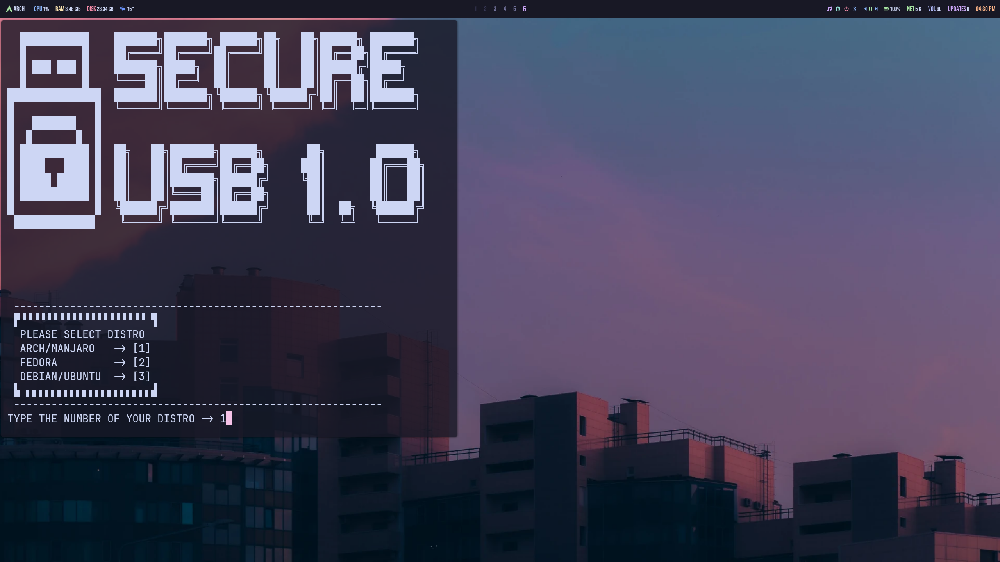
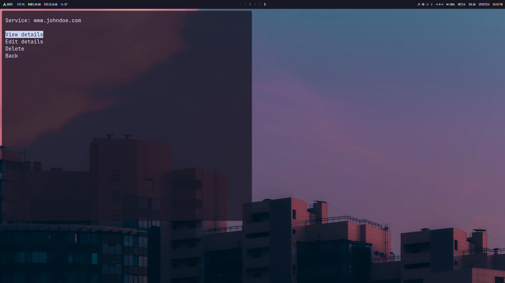

# USB-Secured Password Manager

A terminal-based password manager that locks your credentials inside an encrypted vault.  
Security comes from two layers:  
1. **LUKS-encrypted USB** that holds the secret key.  
2. **Fernet-encrypted vault** that stores your passwords.

---

## Security Features
- LUKS full-disk encryption on USB  
- USB unlock password  
- Fernet encryption of vault file  
- Unique Fernet key stored only on USB  
- Vault file permission hardened to `600`
- Automatic password generator with configurable length and character set
- Argon2 password hashing support / Soon  
- Aliases (`usbon` / `usboff`) for secure mount/unmount  

---

## Requirements
- Python 3.8+  
- System tools: `cryptsetup`, `iptables`, `iproute2`, `xclip`, `systemd`, `sudo`  
- Python packages: `cryptography`, `pyperclip`, `argon2-cffi`

---
## Installation

```bash
git clone https://github.com/NT411/USB-Secured-Password-Manager.git
```
```bash
cd USB-Secured-Password-Manager
```
```bash
chmod +x install.sh
```
```bash
sudo ./install.sh
```
Choose your Linux distro (Arch/Manjaro, Fedora, Debian/Ubuntu) and follow prompts.


    The installer will:

    Install required dependencies

    Set up an encrypted USB

    Generate and store a Fernet key on the USB

    Configure aliases for mounting/unmounting

Usage after installation

Mount the secure USB:
```bash
usbon
```
Start the password manager:
```bash
python3 main.py
```
Unmount the USB when done:
```bash
usboff
```
Do not unlpug the usb before you unmount it and lock it 

**Navigation:

    Arrow keys to move

    Enter to select

    Options: Add, View, Edit, Delete, Quit
    

    

How it Works

    Without the USB, the Fernet key is missing → vault cannot be opened.

    Without the LUKS password, the USB cannot be unlocked.

    Only your Linux user can read the vault (chmod 600).

    Clipboard use avoids typing sensitive strings.


    TODO:
    argon2 / bruteforce deffence
    clipboard countdown 

## Known Issues (Planned Fix)
1) usbon alias is hardcoded to /dev/sda

Currently, the install script creates this alias:

```bash
alias usbon='sudo cryptsetup luksOpen /dev/sda secure_usb ...
```

This assumes your USB device is /dev/sda, which is not always correct.
On many systems the USB device may be /dev/sdb, /dev/sdc, etc.

## How to fix if usbon does not work

List block devices:

```bash
lsblk
```
Example output:
```bash
NAME        MAJ:MIN RM  SIZE RO TYPE MOUNTPOINTS
sda           8:0    1 57.7G  0 disk
nvme0n1     259:0    0  1.8T  0 disk
├─nvme0n1p1 259:1    0    1G  0 part
└─nvme0n1p2 259:2    0  1.8T  0 part
nvme1n1     259:3    0  1.8T  0 disk
├─nvme1n1p1 259:4    0    1G  0 part /boot
└─nvme1n1p2 259:5    0  1.8T  0 part /home
```
Identify your USB device
In this example, the USB device is: 
```bash
sda
```
Edit your shell config:
```bash
nano ~/.bashrc
```
Update the alias to match your device:
```bash
alias usbon='sudo cryptsetup luksOpen /dev/sda secure_usb && sudo mount /dev/mapper/secure_usb ~/mnt/usb_secure'
```
(Replace sda with the correct device if different.)
Reload your shell:
```bash
source ~/.bashrc
```
Important Notes

Do not guess the device name — always confirm with lsblk

Opening the wrong device can lead to data loss

This will be fixed in a future version by storing the selected USB device dynamically
                                     


